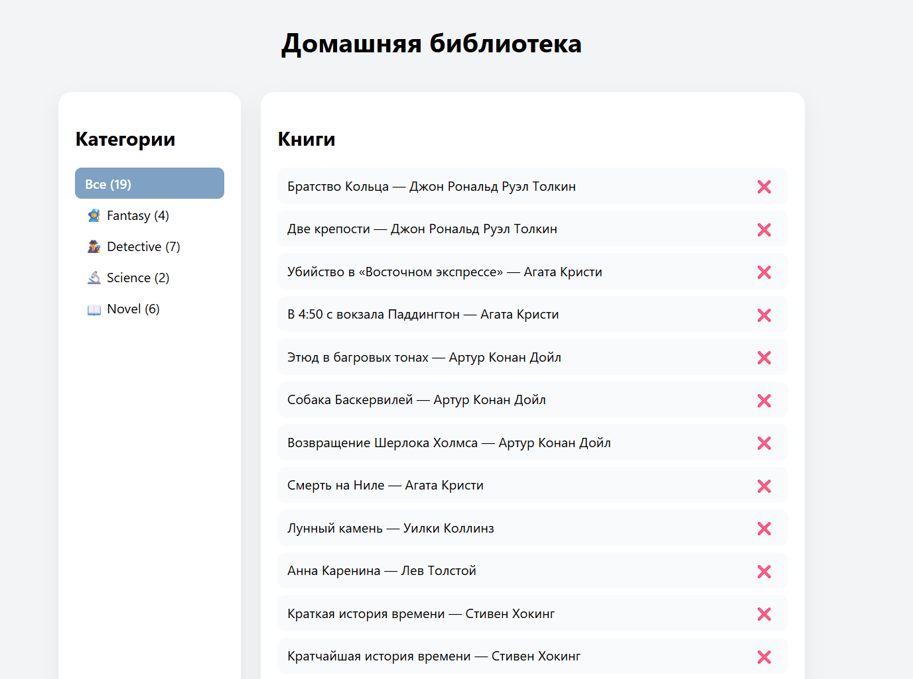

# 📚 Library Home Books

A simple web application for managing a personal home library.

The app allows users to add, edit, delete, and filter books, with all data stored in localStorage.

---

## 🚀 Demo

https://alexandr-dudarin.github.io/library-home-books/

---

## ✨ Features

- Add new books
- Edit existing books
- Delete books
- Filter books by category
- Count total number of books
- Data persistence using localStorage

---

## 🛠️ Tech Stack

- TypeScript
- Vite
- HTML
- CSS
- LocalStorage

---

## 📷 Screenshots



---

## 🧠 What I practiced

- CRUD operations (Create, Read, Update, Delete)
- Working with localStorage
- Data filtering and rendering
- Form handling
- Structuring a small web application

---

## ⚙️ Run locally

```bash
npm install
npm run dev